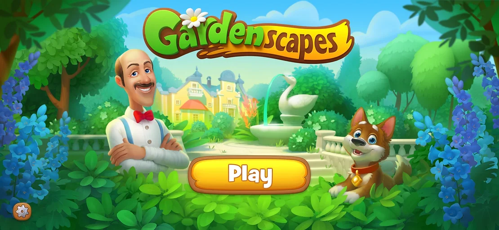
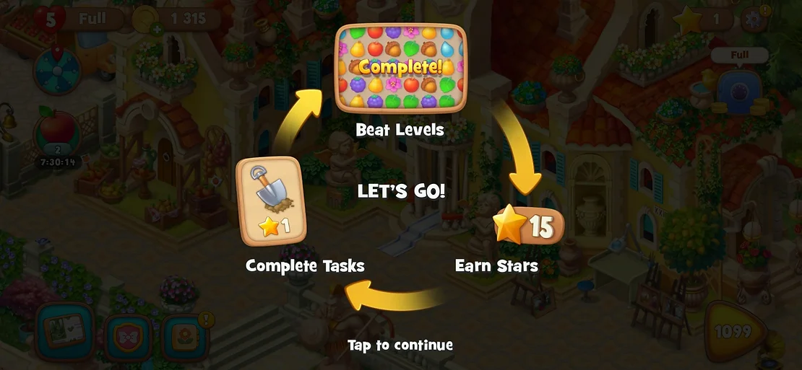
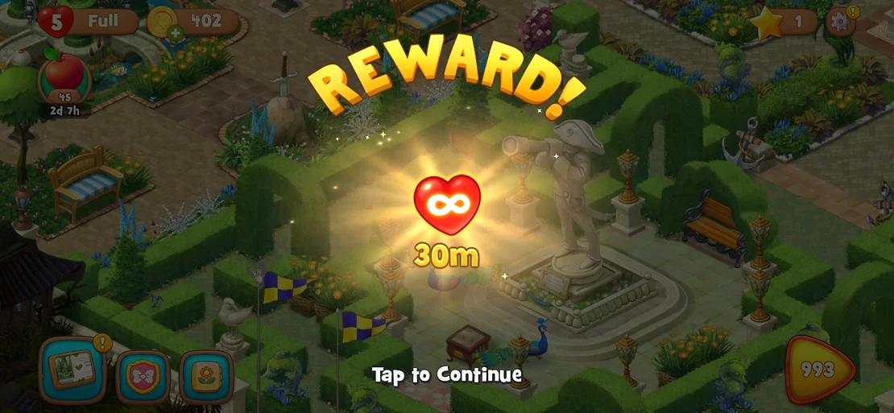
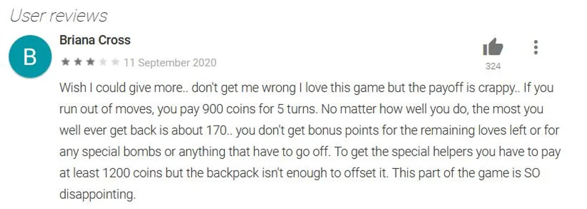
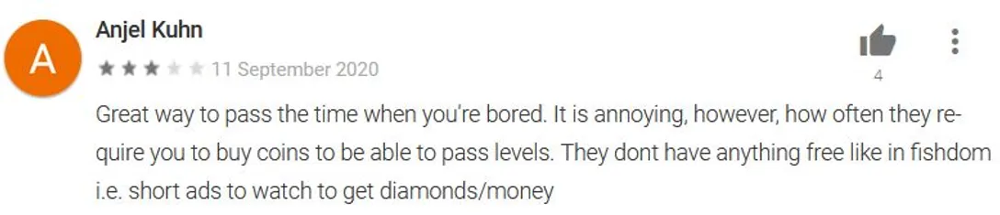
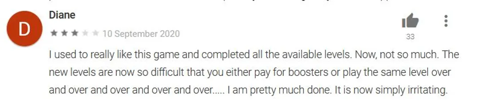
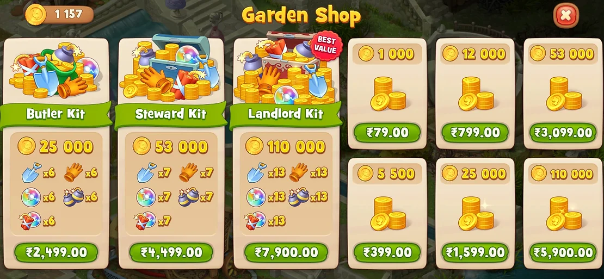

# Introduction

Gardenscapes – New Acres is a casual game developed by Russian studio Playrix that combines elements of Match 3 gameplay with city building.

The core gameplay is based on swapping two adjacent elements to make a row or column or group of at least three elements. By completing match-three levels, players earn stars and coins to complete tasks and progress through the storyline by unlocking new areas.
As players complete tasks, they are allowed to choose between three different decor items for a specific part of their garden, which allows them to decorate their garden.

## Hypothesis 1

To play the match 3 levels one needs lives, without lives, one cannot play the match 3 levels. The game has created a hook by giving players enough opportunities to earn infinite lives for short time periods through various events. More lives, the more you play, more you earn the stars.

Here's where it gets tricky, these rewards get accumulated and the timer starts as soon as you receive them. So suppose you won 5 such rewards for 30mins each, your timer for infinite lives will start for 150 mins, there's no way to claim such rewards at a later time.

So my first hypothesis to increase engagement is that if the users get to choose when to start the 'unlimited lives' rewards, users will be able to use their rewards more effectively which will lead to more engagement in the game.

## Hypothesis 2

Another hurdle that users may face is to earn coins currently, the only way to earn coins is by completing the match-3 levels, often one is just short of a few coins which can help the players continue difficult levels with 5 extra moves.

Here's my second hypothesis: adding "Watch a video ad to earn X amount of coins" will give users the option to earn coins when they are just short and open up another stream of revenue for Playrix increasing monetization and engagement. There will be a cap on the coins the user can earn daily using this feature. The value may need to be iterated but this will encourage users to continue their game just by watching a short video.

## Hypothesis 3

Lastly, more often than not users are just stuck at a normal difficulty level and no amount of power-ups or boosters allow the user to go through, this would be a big drop off point as users would get bored playing the same level repeatedly and just leave the game.

My third hypothesis is that if users can skip levels by paying x amount of coins then these users will not drop off and will try and skip such levels by paying the x amount of coins. This will not only increase engagement but will also give users extra incentive to buy coins which in turn will increase monetization.

## Final Hypothesis

My final hypothesis, adding boosters like (2x coins, +5 moves) in the store for a user to purchase using coins. Currently, these boosters are progress based and come only once a user competes in certain events and clears a certain number of levels, but if a user is stuck at a level, the user will not be able to earn such rewards.

## Conclusion

Overall, Gardenscapes is a fun game to play, if one could earn enough lives, one would be hooked to the game for a long time. My hypotheses may be wrong but these are some suggestions that Playrix can experiment on and get better insights to improve the user engagement and monetization of their game.

### References

- https://en.wikipedia.org/wiki/Gardenscapes:_New_Acres
- https://play.google.com/store/apps/details?id=com.playrix.gardenscapes
